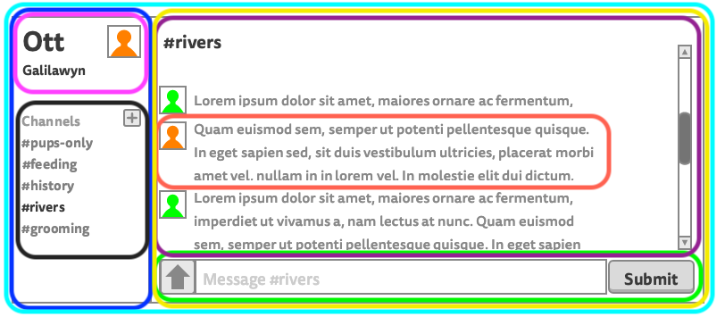

# React: Components and props

## How to lectures with Graham
+ Participation
+ Recording
+ Breaks
+ Should I code along?
+ Falling asleep
+ Question-asking hours

## Key Questions

* What is `create-react-app` and why is it cool?
* How can I create a React app that renders "Hello, World!" to the screen?
* What is JSX and why would I want it in my app?
* What is the virtual DOM and why is it cool?
* What is the difference between the virtual DOM and the actual DOM?
* What's the difference between imperative and declarative programming?
* What is a component in the context of React?
* What is a component made of in JavaScript?
* How can I describe the component hierarchy using the terms root, parent, and child?
* How can I create a React app that renders a container, one list, and five list items?
* How can I define the term prop in the context of React?
* How can I list the types of data that can be passed as props
* How can I identify components from a wireframe and draw out the flow of information?

